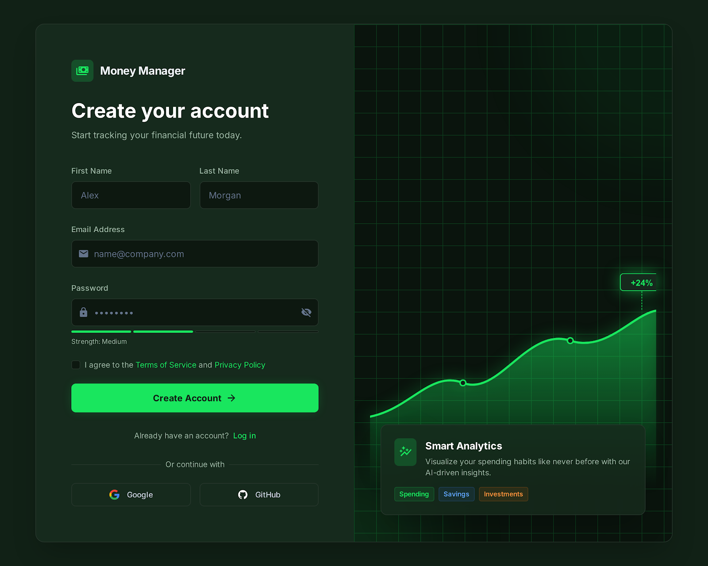
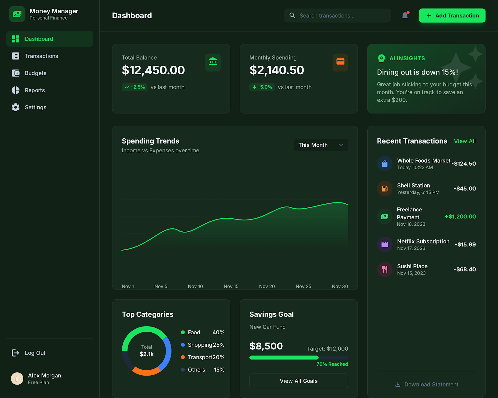
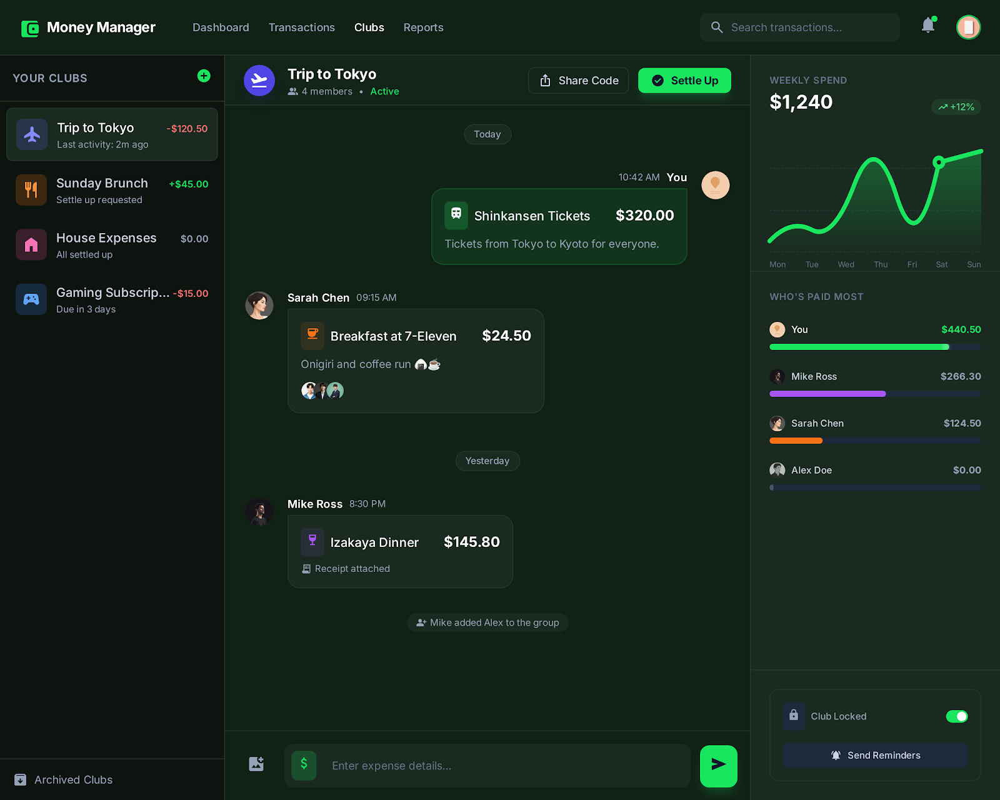

Trackio is a modern open-source AI finance platform that helps you track expenses and subscriptions, set reminders, create budgets, split spending with friends, and gain insights through powerful visualizations and reports.

Built with Next.js, MongoDB, Valkyrie, TypeScript, and Zod.

<p align="center">
  
</p>
<p align="center">
    
    
</p>
## Status

The project is in active MVP hardening. Core auth, dashboard domains, and split-group APIs are wired to backend services.

## Core Features

- Email/password authentication with protected dashboard routes
- Transactions CRUD with export/filter/pagination
- Subscriptions CRUD with status and timeline controls
- Monthly budgets with computed spend/remaining
- Deterministic reports and derived notifications
- Split groups with invite code + passcode join flow
- Group members, expenses, settlements, balances, and activity timeline

## Tech Stack

- Next.js 14 (App Router), React 18, TypeScript
- MongoDB (primary data store)
- Valkey (cache/queue compatible via Redis protocol)
- ioredis client (works with Valkey)
- Tailwind CSS
- Zod validation for API contracts

## Prerequisites

- Node.js 18+
- npm 9+
- Docker + Docker Compose plugin

## Quick Start

1. Install dependencies:

```bash
npm install
```

2. Create env file:

```bash
cp .env.example .env.local
```

3. Start infrastructure (MongoDB + Valkey):

```bash
docker compose up -d
```

4. Start app:

```bash
npm run dev
```

5. Open:

`http://localhost:3000`

## Environment Variables

| Name | Required | Description |
| --- | --- | --- |
| `MONGODB_URI` | Yes | MongoDB connection string |
| `VALKEY_URL` | Yes | Valkey connection string (Redis protocol URL) |
| `JWT_SECRET` | Yes | Secret used for signing auth JWT cookies |
| `NEXT_PUBLIC_APP_URL` | Yes | Public app URL |
| `OPENAI_API_KEY` | No | Optional compatibility variable; reports are deterministic (no LLM required) |
| `REDIS_URL` | No | Backward-compatible alias for `VALKEY_URL` |

## Useful Commands

```bash
npm run dev
npm run dev:app
npm run infra:up
npm run infra:down
npm run lint
npm run build
```

## Docker Services

- `mongodb` on `localhost:27017`
- `valkey` on `localhost:6379`

## API Surface (High Level)

- Auth/User: `/api/auth/*`, `/api/users/me*`
- Transactions: `/api/transactions*`
- Subscriptions: `/api/subscriptions*`
- Budgets: `/api/budgets*`
- Reports: `/api/reports/summary`, `/api/reports/ai-summary`
- Split: `/api/split/groups*`

## Project Layout

```text
src/
  app/            # Routes, pages, API handlers
  components/     # Shared UI + app shell components
  lib/            # Utilities, validators, API helpers, auth
  models/         # Mongoose models
```

## Troubleshooting

- Docker Hub pull timeout (`TLS handshake timeout`):
  - Retry pull and then compose:
    - `docker pull mongo:7`
    - `docker pull valkey/valkey:7-alpine`
    - `docker compose up -d`
- `401` on APIs:
  - Re-authenticate and verify `JWT_SECRET` is set.
- Database connection failures:
  - Ensure `docker compose ps` shows `mongodb` and `valkey` healthy/running.

## Contributing

1. Fork and create a feature branch.
2. Keep changes scoped and type-safe.
3. Run `npm run lint` and `npm run build`.
4. Open a PR with a clear summary and test notes.

## Security

- Do not commit secrets.
- Use strong `JWT_SECRET` values in non-local environments.
- Report vulnerabilities privately before opening public issues.

## License

This project is licensed under the MIT License. See [LICENSE](./LICENSE).

## Design

Design assets and mockups are available in the `design/` directory in this repository. Key files:

- `design/stitch_subscription_and_recurring_payments/code.html` — prototype HTML for subscription flows
- `design/stitch_subscription_and_recurring_payments/screen.png` — mockup image
- `design/stitch_subscription_and_recurring_payments (1)/code.html` — alternate prototype
- `design/stitch_subscription_and_recurring_payments (1)/screen.png` — alternate mockup image

You can open the HTML files directly in a browser or view the PNGs for visual reference.

